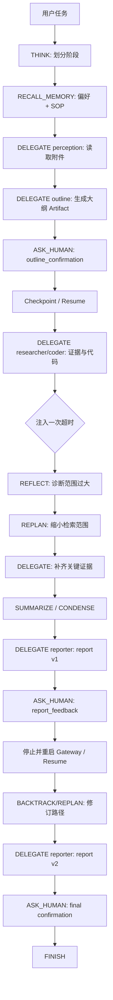

# SP2.0 迁移终审与演示 Case

> 审计日期：2026-07-11
> 代码基线：`a777d9d` + 本轮工作树修改
> 目标：确认 StackPlanner 的控制语义已迁入 DeerFlow 2.0 Runtime，并设计一个能同时体现短期、中期、长期记忆优势的可复现实验。

## 1. 结论

SP2.0 的核心迁移闭环已经成立：

```text
DR2 Runtime
  Gateway / ThreadState / Checkpointer / Workspace / Artifact
  Run-Event / SubagentExecutor / Memory / Skills / SOUL
                         ↑
SP Extension
  CentralAgent / ActionLoop / TaskMemoryStack
  ActionRouter / Handler / PromptContextBuilder
```

- SP 没有建立第二套 Runtime，也没有新增 Gateway、Checkpoint、Workspace、Event Store、Sandbox 或 Memory Store。
- CentralAgent 只输出 Action JSON，不直接调用搜索、Shell、文件、Artifact 或 Memory 工具。
- 短期记忆、中期产物和长期个性化已经进入同一个 DR2 运行链路。
- 当前版本可本地启动；真实 Qwen3-32B smoke test 已在 1 次 Action 内完成 `FINISH`。
- 真实长期 Memory 自动写入仍保持 dry-run，这是方案要求的安全边界，不是遗漏。

## 2. 本轮发现并修正的问题

### 2.1 长期 Memory、SOUL 和 Skills 未直接影响 SP CentralAgent

**修正后：**

```text
SOUL + current date + Skill index
  → CentralAgent system policy

DR2 long-term Memory snapshot
  → CentralAgent user-role decision context

RECALL_MEMORY
  → memory_recaller
  → DR2 Memory / selected procedural Skill
  → normalize
  → TaskMemoryStack
```

这样同时满足两个边界：

- 自动长期记忆可以影响每轮中枢决策，但不会伪装成系统指令，也不会污染 TaskMemoryStack。
- 只有 CentralAgent 显式选择 `RECALL_MEMORY` 后，归一化的召回摘要才会进入 TaskMemoryStack，形成可追踪的任务内依据。

### 2.2 Skills 原先可能被所有 specialist 全量加载

**修正后：**

- CentralAgent 只看到 Skill 名称和简介。
- CentralAgent 在 `DELEGATE` 或流程性 `RECALL_MEMORY` 中填写 `metadata.skill_names`。
- Executor 校验 Skill 必须已启用并位于 Agent 白名单内。
- 只有被选中的子 Agent 加载对应 `SKILL.md` 正文。
- SP specialist 默认 `skills=[]`，避免全量 Skill 常驻上下文。
- 用户级 custom Skill 只在 SP provider 显式开启，默认 DeerFlow Lead Agent 行为保持不变。

新增稳定流程资产：`skills/public/stackplanner-long-task/SKILL.md`。

### 2.3 Artifact current 语义和部分事件不完整

**修正后：**

- Artifact ref 增加 `is_current`。
- 新版本生成时，旧版本保留在 lineage 中但标记为非 current。
- `BACKTRACK` 可以恢复指定版本并重新标记 current。
- 补齐以下事件：
  - `sp.artifact.current_changed`
  - `sp.memory.condensed`
  - `sp.memory.pruned`
- `FINISH` 与 Human Feedback 事件现在统一携带 `run_id` 和时间戳。

### 2.4 历史 GitHub 前端格式失败仍可复现

5 个 branding/auth 文件已经按仓库 Prettier 版本重新格式化。当前本地结果：

- Prettier：通过。
- ESLint：通过。
- TypeScript：通过。
- Frontend unit：`588 passed`。
- Next.js production build：通过，存在 1 条既有 Turbopack NFT trace warning。

本机 `pnpm 10.11.0` 自动获取仓库声明的 `pnpm 10.26.2` 时仍受 npm 证书链影响；上述检查使用现有 `node_modules/.bin` 中的锁定工具完成。CI 需要在推送后重新运行，历史失败 run 本身不会变成成功。

## 3. 迁移方案逐项终审

| 范围 | 状态 | 当前实现 |
| --- | --- | --- |
| 单一 DR2 Runtime | 已落实 | 复用 Gateway、ThreadState、Checkpointer、Workspace、Artifact、Run/Event、SubagentExecutor、Memory |
| CentralAgent 工具隔离 | 已落实 | CentralAgent 只调用模型并输出 Action JSON |
| Action Loop 六节点 | 已落实 | `prepare_context → central_decide → validate_action → execute_action → route_next`，并含 HITL/结束节点 |
| 9 类 Action | 已落实 | THINK、DELEGATE、RECALL_MEMORY、REFLECT、BACKTRACK、REPLAN、SUMMARIZE、ASK_HUMAN、FINISH |
| Action schema 与幂等 | 已落实 | `action_id`、`idempotency_key`、枚举/字段校验、重复副作用保护 |
| 统一 HandlerResult | 已落实 | state、memory、artifact、event、error 统一返回 |
| TaskMemoryStack | 已落实 | append、summarize、condense、prune、backtrack、legacy restore |
| 反馈优先级 | 已落实 | Human Feedback 固定 `critical + pinned`，普通 prune/condense 不删除 |
| 有界中枢上下文 | 已落实 | 单条、活跃条目、字符数和最终 prompt 多层限长 |
| 中期 Artifact 外置 | 已落实 | 报告、提纲、研究正文和文件不进入 ThreadState，只保存 ref |
| Artifact 版本和回溯 | 已落实 | version、parent、history、feedback binding、`is_current` |
| 子 Agent 协议 | 已落实 | researcher、coder、reporter、outline、perception、memory_recaller |
| 子 Agent 返回分流 | 已落实 | summary 入短期栈，大文本入 Artifact，状态/错误入 Run/Event |
| HITL interrupt/resume | 已落实 | pending interaction、隐藏 response、恢复后 pinned feedback |
| FINISH 门禁 | 已落实 | pending human 时拒绝；报告任务缺 final artifact 时拒绝 |
| Checkpoint restore | 已落实 | InMemorySaver 单测覆盖，生产 SQLite Gateway 已启动 |
| 长期 Memory 自动读取 | 已落实 | 复用 DR2 memory data/formatter，以低信任 decision context 注入 |
| 主动长期召回 | 已落实 | `RECALL_MEMORY → memory_recaller → normalize → TaskMemoryStack` |
| 长期候选与 Judge | 已落实 | preference、correction、failure pattern、artifact/event candidate |
| 长期 Memory 写入 | 按设计关闭 | 默认 dry-run，不绕过 DR2 MemoryUpdater |
| SOUL | 已落实 | 内置 SP SOUL；支持 `sp_agent_name/agent_name` 加载用户 custom SOUL |
| Skills | 已落实 | SP long-task Skill、索引、白名单、按 Action 渐进加载 |
| Run/Event 完整性 | 已落实 | 方案列出的 action、handler、delegate、recall、artifact、human、memory、finish 事件均存在 |
| 默认 Lead Agent 兼容 | 已落实 | SP 走独立 factory；SP 专属 Skill 用户隔离通过 opt-in 开关启用 |

## 4. 对方案未写完整处的工程判断

### 4.1 “长期记忆是否进入中枢记忆栈”

不是所有长期记忆都自动写入中枢栈。

- 自动注入：长期 Memory snapshot 只进入当前决策上下文，不写栈。
- 显式召回：`RECALL_MEMORY` 产生 request entry 和 normalized result entry，写入 TaskMemoryStack。
- 原始 memory body、整份 Skill 或历史报告不会进入 TaskMemoryStack。

这是兼顾 token、可追踪性和安全性的实现。

### 4.2 “中期记忆是否需要新 Store”

不需要。中期记忆是一种任务生命周期语义：

- 控制摘要在 TaskMemoryStack。
- 大对象在 Workspace/Artifact。
- 当前指针在 ThreadState。
- 执行轨迹在 Run/Event。
- 恢复由 Checkpointer 完成。

### 4.3 “报告流程要不要硬编码成状态机”

当前选择是：通用安全约束写入代码，稳定业务 SOP 写入 Skill。

- 代码强制：工具隔离、schema、幂等、pending HITL、final artifact、大文本外置。
- Skill 约束：感知、提纲、确认、研究、报告、反馈、修订、验证的推荐顺序。
- CentralAgent 保留根据任务类型跳过无意义阶段的能力。

这比把所有任务锁死为报告状态机更通用。若未来要求“某类报告必须经过两次人工审批”，应新增可配置的 workflow obligation/approval policy，而不是继续加 prompt 文案。

### 4.4 仍建议后续补强的两个点

1. **Feedback obligation ledger**：当前反馈通过 pinned entry 和 artifact binding 表达。若需要严格证明“每条反馈已由哪个版本满足”，应增加轻量 ledger 和 `addressed_by_artifact_id`，但不能把反馈正文重复存多份。
2. **历史归档策略**：模型上下文已受限，但跨很多 run 后 ThreadState 中的 pruned/condensed entry 数量仍会增长。后续可将旧 inactive entry 归档为 Artifact/Event 摘要，同时保留 ID 与 lineage。

这两个点不阻塞当前核心迁移，但会影响超长生命周期任务的治理质量。

## 5. 验证证据

测试组存在重叠，不能直接相加为总用例数。

| 验证范围 | 结果 |
| --- | --- |
| SP 全量测试 | `120 passed` |
| DR2 指定回归：Checkpointer/Subagent/RunEvent/Artifact/Memory/DynamicContext/Skills/Gateway | `321 passed`，1 条依赖弃用 warning |
| 前端 unit | `588 passed` |
| Prettier / ESLint / TypeScript | 全部通过 |
| Next.js production build | 通过，1 条 Turbopack NFT warning |
| Gateway `/health` | `200 healthy` |
| 真实 vLLM `/v1/models` | 返回 `Qwen3-32B` |
| 真实 SP CentralAgent smoke | 1 次 Action 完成 FINISH，`stage=finished` |

## 6. 推荐演示 Case

### Case 名称

**可中断、可恢复、可个性化的 SP1.0 → SP2.0 技术调研汇报**

### 演示目标

用一个任务同时展示：

- 短期记忆：结构化任务栈、反馈优先、压缩与反思。
- 中期记忆：多子 Agent、Artifact 分流、报告版本和 checkpoint restore。
- 长期记忆：Memory、SOUL、Skills、显式 recall 和 dry-run promotion。
- 运行治理：Action schema、幂等、Run/Event、失败恢复和 HITL。

### 输入材料

1. `SP-0617技术汇报-v4.pdf`。
2. SP 框架迁移方案 Markdown。
3. 当前 StackPlanner2 仓库。
4. 可选：一张 SP1.0 架构图。当前 Qwen3-32B 配置不支持视觉；展示图片理解时需切换 `supports_vision=true` 的模型。

### 预置个性化

**SOUL**

```text
你是组会技术汇报型 Agent。默认中文，先给判断再给证据；
避免宣传式语言，所有结论必须对应代码、测试或明确的设计依据。
```

**长期 Memory**

```text
老师只接触过 SP1.0。
老师更关心短期、中期、长期记忆的变化，不需要大段工程细节。
组会材料默认简洁、结论先行。
```

**Skills**

```text
stackplanner-long-task
deep-research
ppt-generation
```

### 用户首轮 Prompt

```text
请基于附件、迁移方案和当前仓库，生成《StackPlanner 2.0 框架迁移评估》组会材料。

要求：
1. 老师只了解 SP1.0，要重点讲清楚 SP2.0 在短期、中期、长期记忆上的增强；
2. 先读取材料并召回我的长期偏好；
3. 先生成大纲，必须等我确认后再继续；
4. 所有代码判断都要有文件或测试依据；
5. 研究或代码检查失败时，先 REFLECT，再缩小范围 REPLAN；
6. 报告正文、证据和 PPT 提纲必须保存为 Artifact，ThreadState 只留引用；
7. 报告 v1 完成后再次请求我反馈，修改后生成 v2，再结束。
```

### 预期 Action 主链



### 两次人工反馈

**大纲确认**

```text
保留三层记忆对比，把“中间件链”单独讲一页；删掉部署细节。
```

**报告反馈**

```text
第二部分增加 CentralAgent 不直接调用工具的代码证据；
中期记忆增加 report v1/v2 的版本示例；不要改变当前结论。
以后组会材料都默认先结论后证据。
```

第二条反馈中的“以后都默认”应生成长期偏好 candidate，但只产生 `sp.memory.promotion.dry_run`，不自动写 Memory。

### 故障与恢复注入

为了避免演示只覆盖 happy path，固定加入两个故障：

1. 第一次 researcher 返回 `timed_out/turn_capped`，检查 CentralAgent 是否先 `REFLECT` 再 `REPLAN`。
2. report v1 等待反馈时停止 Gateway，重启后用同一 `thread_id` 恢复，检查是否重复创建 v1。

### 预期 Artifact

| Artifact | 关键要求 |
| --- | --- |
| perception observation | 附件结构、直接观察、未知项 |
| outline v1 | 章节目的、证据需求、待确认问题 |
| research observation | 代码路径、测试证据、冲突与未验证项 |
| report revision v1 | 首版完整报告，`is_current=false` after v2 |
| report revision v2 | 绑定反馈、parent=v1、`is_current=true` |
| PPT outline | 页号、内容、布局，正文不进入 ThreadState |

### 验收指标

| SP2.0 特点 | 通过条件 |
| --- | --- |
| CentralAgent 隔离 | Trace 中无 CentralAgent 直接 search/bash/file/memory tool call |
| 短期记忆 | Feedback 为 `critical+pinned`；大文本不在 `sp_task_memory` |
| 上下文治理 | 出现 condense/prune event；pinned feedback 始终可见 |
| 子 Agent 委派 | 每次 DELEGATE 都经过 Router、Handler、SubagentExecutor |
| Skill 渐进加载 | 只有 action 中选中的 Skill 被对应子 Agent 加载 |
| Artifact 管理 | v1/v2 都存在；只有 v2 current；反馈绑定到目标版本 |
| 中断恢复 | 重启后从 pending HITL 继续；无重复副作用 |
| 失败恢复 | timeout 后顺序为 REFLECT → REPLAN → narrower DELEGATE |
| 长期读取 | 自动 Memory snapshot 可见；RECALL 结果以摘要进入 TaskMemoryStack |
| 长期写入安全 | 产生 candidate 和 dry-run event，真实 write count 为 0 |
| 可观测性 | action → handler → delegate → artifact → human → finish 事件链完整 |

### 演示输出

演示结束只展示四个页面或结果：

1. Action/Run Event 时间线。
2. TaskMemoryStack 中 pinned feedback 与 condensed summary。
3. Artifact v1/v2 lineage 和 current 切换。
4. 最终组会报告/PPT 提纲，以及 dry-run memory candidate。

这样可以直观证明：SP2.0 的增强不是“多了几个工具”，而是复杂任务的控制、记忆、产物、恢复和个性化已经进入同一个可治理 Runtime。

## 7. 尚需真实环境验证

- 当前模型不支持视觉，perception 的真实图片理解需换视觉模型验证。
- 真实搜索服务、远程 Sandbox 和多用户并发隔离尚未做完整 E2E。
- 首启 Gateway 尚未创建管理员，因此 authenticated thread/run/browser E2E 未执行。
- 生产数据库跨进程 checkpoint、Gateway 重启后 HITL 恢复需在目标部署方式验证。
- 至少需要 3 个 15 至 30 分钟真实长任务，记录完成率、重复 Action、人工介入、token、耗时和 Artifact 质量。
